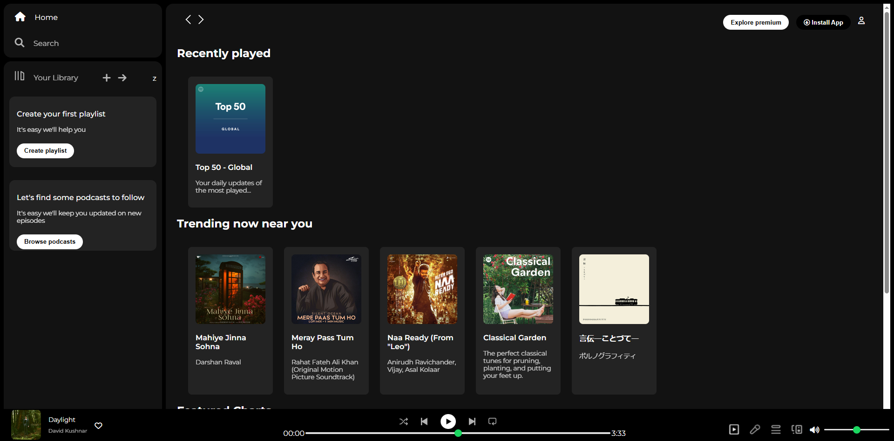

My Spotify Clone
This is a simple front-end clone of Spotify, built just with HTML and CSS. I made it to practice my web development skills!

📸 Screenshots
Here's how my Spotify clone looks:

Spotify Clone Desktop View This is the main desktop view of the Spotify clone.

✨ Features
Looks like Spotify: I tried to match Spotify's dark theme and layout.
Navigation Bar: Has the left sidebar with Home, Search, and Library.
Content Sections: Shows sections like "Recently played" and "Trending now."
Player Bar: There's a basic player bar at the bottom.
▶️ Demo
You can see this project live in your browser here:
[**View Live Demo**](https://rutss-code.github.io/spotify-clone/)
View Live Demo

(To make the demo work, you need to enable GitHub Pages for your project. Go to your GitHub repo, click "Settings," then "Pages," and select your main or master branch. The link will then appear there!)

🚀 How to Run It Yourself
It's super easy!

Get the code:
git clone [https://github.com/rutss-code/spotify-clone.git](https://github.com/rutss-code/spotify-clone.git)
Go into the folder:
cd spotify-clone
Open in your browser: Just double-click the index.html file in the project folder!
👋 Contact
Have questions or just want to connect?

_GitHub:_ [rutss-code](https://github.com/rutss-code)
_Email:_ [rutujagujar08@gmail.com](mailto:rutujagujar08@gmail.com)
